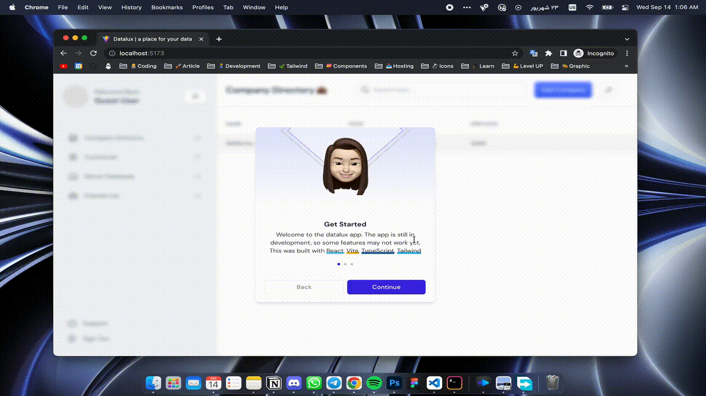

<h1 align="center">
  <br>
  <a href="https://github.com/SadeghRastgoo/datalux"></a>
  <br>
  Datalux
  <br>
</h1>

<h4 align="center">A minimal place for your <a href="#">Data</a>.</h4>

<p align="center">
  <a href="#key-features">Key Features</a> •
  <a href="#how-to-use">How To Use</a> •
  <a href="#Live-Preview">Live Preview</a> •
  <a href="#license">License</a>
</p>



## Key Features

* LivePreview - Make changes, See changes
  - Instantly see how cells will look as you create/edit/delete them.
* Each file can contain a large number of rows
* Dark Mode support is available 
* Reorder your files

## How To Use

To clone and run this application, you'll need [Git](https://git-scm.com), [Node.js](https://nodejs.org/en/download/) and [Yarn](https://classic.yarnpkg.com/lang/en/docs/install/) installed on your computer. From your command line:

```bash
# Clone this repository
$ git clone https://github.com/SadeghRastgoo/datalux

# Go into the repository
$ cd datalux

# Install dependencies
$ yarn

# Run the app
$ yarn dev
```

> **Note**
> If you're using Linux Bash for Windows, [see this guide](https://www.howtogeek.com/261575/how-to-run-graphical-linux-desktop-applications-from-windows-10s-bash-shell/) or use `node` from the command prompt.


## Live Preview

Using below link, you can explore the datalux app and sign in:
https://datalux.vercel.app/

## Credits

This software uses the following open source packages:

- [React.js](https://reactjs.org/)
- [Vite](https://vitejs.dev/)
- [Tailwind](https://tailwindcss.com/)
- [TypeScript](https://www.typescriptlang.org/)

## License

MIT

---

> GitHub [@amitmerchant1990](https://github.com/sadeghrastgoo) &nbsp;&middot;&nbsp;
> Twitter [@amit_merchant](https://twitter.com/sadeeeegh)

